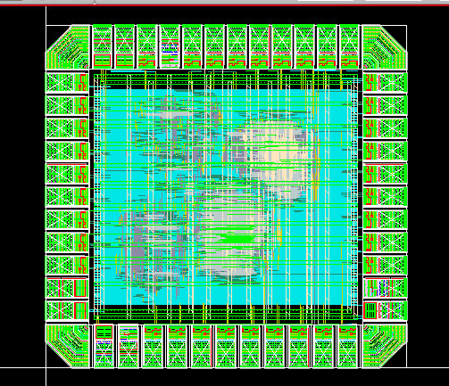

# Physical Design

## 1. Overview

Cadence Innovus was used to implement the synthesized interpolation core as a routed pad-level ASIC.

The physical-design flow includes:

```text
Design Initialization
      |
      v
Floorplan + Pad Integration
      |
      v
Power Planning
      |
      v
Placement
      |
      v
Clock-Tree Synthesis
      |
      v
Routing
      |
      v
Post-Route Optimization / ECO
      |
      v
Parasitic Extraction
      |
      v
Final Implementation Checks
```



## 2. Input and MMMC Setup

The implementation database is initialized from:

- synthesized gate-level netlist;
- exported SDC constraints;
- pad-level top-level connectivity;
- I/O placement;
- LEF/technology data;
- MMMC analysis views.

The implementation uses separate setup- and hold-oriented views. The final external signoff is performed independently with PrimeTime.

## 3. Floorplan and Pad Integration

| Metric | Final Value |
|---|---:|
| Die size | **1000 x 950 um** |
| Die area | **0.950 mm²** |
| Core size | **646 x 596 um** |
| Core area | **385,016 um²** |
| Primary I/O ports | 36 |

The pad ring contains 4 primary input ports and 32 output ports around the digital interpolation core.

## 4. Power Distribution

The power network is created before standard-cell placement and includes the core rings/straps, rail connectivity, and pad-to-core supply connections required by the pad-level design.

Static rail analysis was later used to study VDD/VSS distribution. This is discussed in [Power Analysis](Power_Analysis.md).

## 5. Placement

Placement and pre-CTS optimization were performed before clock-tree synthesis.

Final placement checks report:

```text
Unplaced instances: 0
Placement violations: 0
```

## 6. Clock-Tree Synthesis

Cadence CCOpt was used for clock-tree synthesis.

Final CTS statistics include:

| CTS Metric | Result |
|---|---:|
| Clock sinks | 1,063 |
| Regular sequential sinks | 1,026 |
| Enable-latch sinks | 37 |
| Clock buffers | 10 |
| Clock-gating elements | 37 |
| Routed clock-wire length | ~13.10 mm |

The final timing criterion is taken from PrimeTime after routing and extraction.

## 7. Routing and ECO Closure

After CTS, signal routing and post-route optimization were performed. ECO iterations repaired remaining implementation/timing issues while preserving design functionality.

The final Innovus checks report:

| Check | Result |
|---|---|
| Placement | **PASS** |
| Connectivity | **No problems or warnings** |
| Innovus DRC | **0 violations** |

## 8. Parasitic Extraction

Final post-route SPEF files were generated for slow- and fast-RC conditions:

```text
top_slow.SPEF
top_fast.SPEF
```

These parasitics are used by PrimeTime for final setup/hold analysis.

## 9. Final Physical Outputs

Important public-facing handoff files include:

```text
top_final_final_lvs.v
top_slow.SPEF
top_fast.SPEF
```

The final GDS is used for Calibre DRC/LVS but does not need to be distributed in the public repository.

## 10. Innovus Repository Structure

```text
Innovus/
├── datain/
│   └── saif/
├── scripts/
├── reports/
├── power/
├── dataout/
└── work/
```

The `SAIF_Generation/` directory is intentionally separate from Innovus. Its generated activity files are staged into `Innovus/datain/saif/` for power analysis.

Post-route power is described in [Power Analysis](Power_Analysis.md), while final PrimeTime/DRC/LVS results are documented in [Signoff](Signoff.md).
