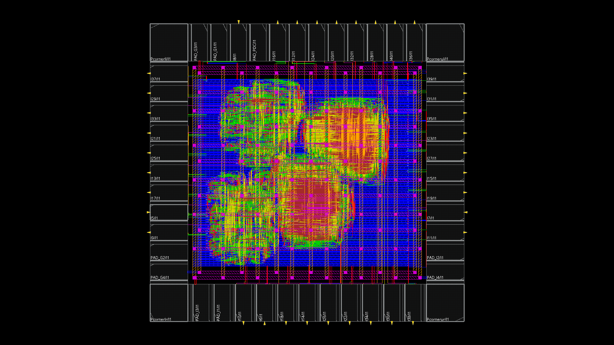

# Physical Design

## Overview

The synthesized ASIC was implemented using Cadence Innovus in a 65 nm low-power standard-cell flow. The physical-design stage included design initialization, floorplanning, power planning, placement, clock-tree synthesis, routing, ECO closure, extraction, power analysis, and final implementation checks.

The final design is a routed pad-level implementation containing the synthesized interpolation core and the I/O pad ring.



## Design Initialization

The physical-design database was initialized using the synthesized gate-level netlist, timing constraints, pad-level top module, I/O placement information, and MMMC setup. Separate analysis views were used for setup and hold analysis during implementation.

The implementation uses one external high-frequency clock domain, with internal clock-enable structures used to control the multi-rate datapath.

## Floorplanning and Pad Integration

The final die boundary is **1000 µm × 950 µm**, corresponding to a chip area of **0.95 mm²**. The core boundary is approximately **646 µm × 596 µm**, with a reported core area of **385,016 µm²**.

The final pad-level design contains 36 primary I/O ports: 4 inputs and 32 outputs. The pad ring surrounds the digital core and provides the interface between the core and the external chip pins.

## Placement

Placement and optimization were performed before clock-tree synthesis. The final Innovus placement check reported no placement violations and no unplaced instances.

The routed database contains 150,126 standard-cell instances when physical/filler cells are included. The functional standard-cell area excluding physical cells is approximately 149,275 µm².

## Clock-Tree Synthesis

Clock-tree synthesis was performed using Innovus CCOpt. The final clock tree drives **1,063 clock sinks**, consisting of 1,026 regular sequential sinks and 37 enable-latch sinks.

The generated clock network contains 10 clock buffers and 37 discrete clock-gating elements. The total reported routed clock-wire length is approximately 13.10 mm.

Final timing closure was verified independently using PrimeTime; the final signoff reports show positive setup and hold slack.

## Routing and ECO Closure

After CTS, signal routing and post-route optimization were performed. ECO iterations were used to repair timing and physical-design issues while preserving the implemented functionality.

The final Innovus connectivity check reported no problems or warnings, and the final Innovus DRC check reported no violations.

## Parasitic Extraction

Post-route parasitic extraction was performed for timing signoff. Separate SPEF files were generated for the slow and fast RC conditions:

```text
top_slow.SPEF
top_fast.SPEF
```

These extracted parasitics were used by PrimeTime for final post-layout setup and hold analysis.

## Power Analysis

Post-route power analysis was performed in Innovus using SAIF switching activity for each interpolation mode. The uploaded reports correspond to the interpolation core instance `I0`; therefore, the values below are **core power**, not whole-chip pad-inclusive power.

The SAIF activity annotation coverage reported by Innovus was approximately **75.37%**.

### Total Core Power

| L | SlowView (mW) | TypView (mW) | FastView (mW) |
|---:|---:|---:|---:|
| 2 | 93.20 | 80.70 | 128.53 |
| 3 | 112.57 | 103.60 | 155.43 |
| 4 | 115.26 | 107.01 | 159.50 |
| 5 | 117.16 | 109.51 | 162.62 |

The power increases with interpolation factor because higher values of \(L\) produce a higher output-sample activity rate and therefore more datapath switching.

At the typical view, the power breakdown was:

| L | Internal (mW) | Switching (mW) | Leakage (mW) | Total (mW) |
|---:|---:|---:|---:|---:|
| 2 | 49.11 | 31.57 | 0.027 | 80.70 |
| 3 | 64.04 | 39.53 | 0.027 | 103.60 |
| 4 | 65.93 | 41.05 | 0.027 | 107.01 |
| 5 | 67.39 | 42.09 | 0.027 | 109.51 |

## Power-Integrity Analysis

Power-rail analysis was also performed for the VDD and VSS networks. The results indicate that additional IR-drop margin could be obtained in a future implementation by strengthening the power-delivery network.

Possible improvements include:

- increasing the number of VDD/VSS pads,
- widening the power rings and major straps,
- increasing power-grid strap density,
- adding parallel vias at high-current connections, and
- redistributing high-current regions to reduce local current concentration.

IR-drop closure was not an explicit pass/fail requirement of this academic implementation, so this analysis is treated as a direction for further physical-design optimization.

## Final Physical-Design Outputs

The main generated implementation outputs include:

```text
top_final_final_lvs.v   # final post-layout Verilog netlist
top_slow.SPEF           # slow-corner extracted parasitics
top_fast.SPEF           # fast-corner extracted parasitics
```

The final GDS was used for physical verification but is not required as a public repository artifact.

## Related Files

```text
Physical_Design/
├── datain/
├── dataout/
├── reports/
├── power_reports/
└── scripts/
```

Final logical and physical signoff results are summarized in [Signoff.md](Signoff.md).
