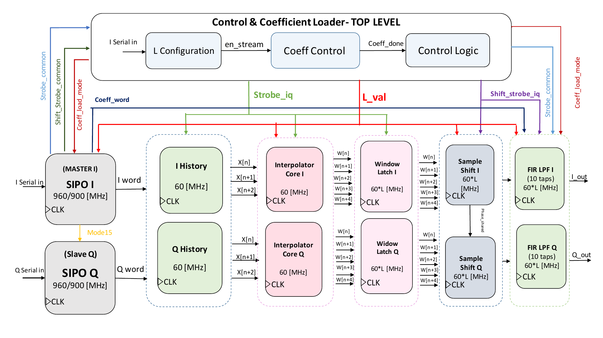

# RTL Architecture and Implementation

## 1. Overview

The synthesizable top-level module is `top_interpolator_dac`. It implements two parallel I/Q processing paths and shared configuration/timing control.

The final architecture is shown below.



The diagram separates the design into five main functions:

1. **Configuration and coefficient control**
2. **Serial I/Q reception**
3. **Three-sample history and MINAJ2 interpolation**
4. **Interpolation-window storage and phase-based sample selection**
5. **Programmable FIR filtering**

A key architectural choice is that the **I path is the timing master** and the **Q path is the timing slave**. `mode15_word` is passed from I to Q, and `phase_shared` is passed from Sample Shift I to Sample Shift Q. This keeps the two components of the complex signal aligned.

## 2. Top-Level Parameters and Interface

Main parameters:

| Parameter | Value | Description |
|---|---:|---|
| `WL` | 16 | Main signal word length |
| `FL` | 12 | Main signal fractional length |
| `NTAPS` | 10 | Number of FIR taps |

Main top-level signals:

| Signal | Direction | Width | Function |
|---|---|---:|---|
| `clk` | Input | 1 | External 900/960 MHz system clock |
| `reset` | Input | 1 | Active-high reset |
| `serial_in_I` | Input | 1 | I data, L configuration, and FIR coefficients |
| `serial_in_Q` | Input | 1 | Q data during normal streaming |
| `dac_I` / `I_out` | Output | 16 | Filtered interpolated I output |
| `dac_Q` / `Q_out` | Output | 16 | Filtered interpolated Q output |

All sequential RTL remains in the `clk` domain. The lower functional rates are created by enables and one-cycle strobes.

## 3. Operating Modes

| L | Clock | `mode15_word` in normal streaming | Normal Word | Input Rate | Output Rate |
|---:|---:|---:|---:|---:|---:|
| 2 | 960 MHz | 0 | 16 bits | 60 MSa/s | 120 MSa/s |
| 3 | 900 MHz | 1 | 15 bits | 60 MSa/s | 180 MSa/s |
| 4 | 960 MHz | 0 | 16 bits | 60 MSa/s | 240 MSa/s |
| 5 | 900 MHz | 1 | 15 bits | 60 MSa/s | 300 MSa/s |

For the 15-bit modes, the reconstructed sample is sign-extended from bit 14:

```text
internal_word[14:0] = received 15-bit sample
internal_word[15]   = internal_word[14]
```

During FIR coefficient loading, the effective serial word mode is forced to 16 bits even for \(L=3\) and \(L=5\).

## 4. Configuration Capture

`spi_cfg4_nomode` monitors `serial_in_I` after reset.

The configuration sequence is:

```text
0...0     ignored while waiting for synchronization
1         synchronization marker
L[0]      first L bit
L[1]      second L bit
L[2]      third L bit
```

After the third \(L\) bit, the configuration value is stored as `L_val` / `L_ctrl` and the configuration-ready event enables the remaining serial logic:

```text
en_stream = cfg_ready_now
```

`en_stream` therefore means that the interpolation-factor configuration is complete. It does **not** yet mean that normal I/Q processing is allowed.

## 5. Coefficient-Loading State

Immediately after \(L\) is captured:

```text
en_stream = 1
coeff_done = 0
```

The top-level control creates:

```text
coeff_load_mode = en_stream && !coeff_done
en_iq           = en_stream &&  coeff_done
```

The three operating intervals are:

| State | `en_stream` | `coeff_done` | `coeff_load_mode` | `en_iq` | Active Function |
|---|---:|---:|---:|---:|---|
| Waiting for L | 0 | 0 | 0 | 0 | Capture synchronization + L |
| FIR loading | 1 | 0 | 1 | 0 | Receive ten 16-bit coefficients |
| Normal streaming | 1 | 1 | 0 | 1 | Process I/Q samples |

This gating prevents FIR configuration words from entering the interpolation datapath.

## 6. FIR Coefficient Loading

The coefficients enter only through the I serial input.

During coefficient loading:

```text
coeff_word = word_I
```

Each one-cycle `strobe_common` pulse indicates that a complete 16-bit coefficient is available in `word_I`.

Both FIR instances receive the same coefficient:

```text
coeff_load_en = coeff_load_mode
coeff_strobe  = strobe_common
coeff_word    = word_I
```

`coeff_count` advances once per completed coefficient. With `NTAPS=10`, coefficients 0 through 9 are loaded. After the tenth coefficient:

```text
coeff_done = 1
```

and normal I/Q processing begins.

### Coefficient-Loading Rate

Because coefficient words are always 16 bits:

| Mode Clock | Coefficient Word Width | `strobe_common` Rate During Coefficient Loading |
|---:|---:|---:|
| 960 MHz | 16 bits | 60 MHz |
| 900 MHz | 16 bits | 56.25 MHz |

This rate difference exists only during coefficient loading. Normal source samples arrive at 60 MSa/s for every \(L\).

## 7. SPI-I Master and SPI-Q Slave

### 7.1 I Serial Master

`spi_i_master` performs three main tasks:

1. reconstructs the serial I word;
2. selects 15- or 16-bit normal operation;
3. generates the raw input and output timing strobes.

The normal word terminal count is:

```text
16-bit mode : terminal bit count = 15
15-bit mode : terminal bit count = 14
```

A one-clock `strobe_common` pulse is generated whenever a complete word has been reconstructed.

### 7.2 Q Serial Slave

`spi_q_slave` reconstructs the Q word but follows the mode decision made by the I master.

`mode15_word` is passed from I to Q, so both channels:

- use the same word length;
- finish on the same clock edge;
- use the same sign-extension rule;
- enter the history registers as an aligned complex pair.

## 8. Main Control and Timing Signals

The most important shared signals are summarized below.

| Signal | Generated By | Used By | Meaning / Active Condition |
|---|---|---|---|
| `L_val` / `L_ctrl` | Configuration block | SPI, interpolator, Sample Shift | Selected interpolation factor \(2..5\) |
| `en_stream` | Configuration block / top | SPI and coefficient control | Becomes 1 after the three \(L\) bits are captured |
| `coeff_load_mode` | Top-level control | SPI-I and FIRs | `en_stream && !coeff_done`; enables coefficient reception |
| `coeff_word` | SPI-I / top | FIR I and FIR Q | Current signed 16-bit FIR coefficient |
| `coeff_done` | Coefficient counter | Top-level control | Becomes 1 after all 10 coefficients are loaded |
| `en_iq` | Top-level control | I/Q datapath | `en_stream && coeff_done`; normal processing enable |
| `mode15_word` | SPI-I master | SPI-Q slave | 1 for normal \(L=3,5\); 0 for \(L=2,4\); forced to 16-bit mode during coefficient loading |
| `strobe_common` | SPI-I master | Coefficient loader / top | One-cycle pulse when a complete serial word is available |
| `strobe_iq` | Top-level control | History, MINAJ2, window logic | `strobe_common && coeff_done`; one new I/Q pair at 60 MHz |
| `shift_strobe_common` | SPI-I master | Top-level control | Raw output scheduler pulse at \(60L\) MHz |
| `shift_strobe_iq` | Top-level control | Sample Shift and FIR path | `shift_strobe_common && coeff_done` |
| `phase_shared` | Sample Shift I | Sample Shift Q | Shared interpolation phase index; Q follows I |
| `word_I` | SPI-I | I history / coefficient loader | Reconstructed I sample or coefficient |
| `word_Q` | SPI-Q | Q history | Reconstructed Q sample |

## 9. Strobe Rates by Mode

After coefficient loading is complete, `strobe_iq` always represents a 60 MHz input-sample event. `shift_strobe_iq` represents the interpolated output event.

| L | Clock | Normal Word Length | `strobe_iq` Interval | `strobe_iq` Rate | `shift_strobe_iq` Interval | `shift_strobe_iq` Rate |
|---:|---:|---:|---:|---:|---:|---:|
| 2 | 960 MHz | 16 | 16 clocks | 60 MHz | 8 clocks | 120 MHz |
| 3 | 900 MHz | 15 | 15 clocks | 60 MHz | 5 clocks | 180 MHz |
| 4 | 960 MHz | 16 | 16 clocks | 60 MHz | 4 clocks | 240 MHz |
| 5 | 900 MHz | 15 | 15 clocks | 60 MHz | 3 clocks | 300 MHz |

`shift_strobe_common` can already be generated after `en_stream` becomes active, but `shift_strobe_iq` remains blocked until `coeff_done=1`.

## 10. What Happens on `strobe_iq`

Each `strobe_iq` pulse represents one newly reconstructed complex input sample.

On this event:

1. `word_I` and `word_Q` are accepted as the new source sample pair;
2. the three-sample history shifts;
3. the MINAJ2 state is updated from the new three-sample window;
4. a new interpolation window is computed;
5. the interpolation-window registers are refreshed;
6. the I-path phase state starts the new window from phase 0.

The source-window update rate is therefore 60 MHz.

The stored interpolation window is then read at \(60L\) MHz by the Sample Shift stage.

## 11. Three-Sample History

Each channel uses `word_history3`.

On `strobe_iq`:

```text
w2 <- w1
w1 <- w0
w0 <- new_sample
```

The MINAJ2 block interprets the history as:

```text
x_prev = w2
x_c    = w1
x_n    = w0
```

Between `strobe_iq` events, the history state is held.

## 12. MINAJ2 Slope Calculation

The recursive MINAJ2 slope numerator is

$$
S = 8x_c + 3x_n - 11x_{prev} - 4m_p
$$

where:

- \(x_{prev}\) is the previous source sample;
- \(x_c\) is the current center sample;
- \(x_n\) is the newest sample;
- \(m_p\) is the previously stored slope.

The RTL approximates division by ten using multiplication by 1638 followed by an arithmetic shift of 14 bits.

Mathematically, the implemented operation is equivalent to

$$
m_{raw} = \frac{S\cdot1638 + 8192}{2^{14}}
$$

and the RTL performs the scale operation as:

```text
m_raw = (S * 1638 + 8192) >>> 14
```

The final slope is saturated to the signed 16-bit range:

$$
m_{new} = sat_{16}(m_{raw})
$$

The `8192` term provides the half-LSB bias before the right shift.

## 13. Cubic Polynomial

For each source interval, define

$$
\Delta = x_c - x_{prev}
$$

The cubic coefficients are:

$$
c_0 = x_{prev}
$$

$$
c_1 = m_p
$$

$$
c_2 = 3\Delta - 2m_p - m_{new}
$$

$$
c_3 = m_p + m_{new} - 2\Delta
$$

The cubic is evaluated in Horner form:

$$
y(u) = \big((c_3u+c_2)u+c_1\big)u+c_0
$$

The normalized phase \(u\) is represented in Q1.15.

## 14. Q1.15 Interpolation Positions

The hardware uses fixed integer constants for the required fractions.

| Fraction | Q1.15 Integer |
|---:|---:|
| \(1/5\) | 6554 |
| \(1/4\) | 8192 |
| \(1/3\) | 10923 |
| \(2/5\) | 13107 |
| \(1/2\) | 16384 |
| \(3/5\) | 19661 |
| \(2/3\) | 21845 |
| \(3/4\) | 24576 |
| \(4/5\) | 26214 |

The cubic intermediate products are rescaled after each Q1.15 multiplication using the same fixed-point behavior as the MATLAB RTL golden model.

## 15. Interpolation Window

The MINAJ2 hardware can produce up to five stored values for one input interval:

```text
W[n]
W[n+1]
W[n+2]
W[n+3]
W[n+4]
```

Only the first \(L\) values are used in the selected mode.

| L | Valid Window Entries |
|---:|---|
| 2 | `W[n]`, `W[n+1]` |
| 3 | `W[n]`, `W[n+1]`, `W[n+2]` |
| 4 | `W[n]`, `W[n+1]`, `W[n+2]`, `W[n+3]` |
| 5 | `W[n]`, `W[n+1]`, `W[n+2]`, `W[n+3]`, `W[n+4]` |

The window is refreshed once per `strobe_iq` input event. Its entries are then consumed one-by-one at the output rate.

## 16. `phase_shared` and I/Q Synchronization

Sample Shift I owns the phase counter. Its current phase is exported as `phase_shared` to Sample Shift Q.

The valid phase range is:

$$
0 \le phase < L
$$

and the phase selects the corresponding stored window entry.

| L | `phase_shared` Sequence | Selected Samples |
|---:|---|---|
| 2 | 0, 1 | `W[n]`, `W[n+1]` |
| 3 | 0, 1, 2 | `W[n]` ... `W[n+2]` |
| 4 | 0, 1, 2, 3 | `W[n]` ... `W[n+3]` |
| 5 | 0, 1, 2, 3, 4 | `W[n]` ... `W[n+4]` |

At each `shift_strobe_iq` pulse:

1. Sample Shift I selects one I interpolation point;
2. Sample Shift Q uses the same `phase_shared` value;
3. the selected I/Q pair enters the corresponding FIR delay line;
4. the phase advances to the next valid value.

When a new input window arrives, the I phase restarts from the beginning of the new window.

If an input-window event and an output-shift event occur on the same clock edge, the input update has priority. This is important for maintaining correct phase alignment, especially in the \(L=5\) mode.

## 17. Programmable 10-Tap FIR

Each channel contains one 10-tap FIR instance.

The FIR performs

$$
y[n] = \sum_{k=0}^{9} h[k]x[n-k]
$$

using:

- signed 16-bit input samples;
- ten signed 16-bit Q12 coefficients;
- a wide internal multiply-accumulate datapath;
- scaling back by 12 fractional bits;
- signed 16-bit output saturation.

The RTL MAC accumulator is 48 bits wide.

The final bit-accurate regression uses the same FIR state-update order and `FIR_ROUND=0` behavior as the RTL golden model.

## 18. End-to-End RTL Sequence

```text
Reset
  |
  v
Detect sync marker
  |
  v
Capture L[2:0]
  |
  v
en_stream = 1
  |
  v
Force 16-bit coefficient words
  |
  v
Load 10 coefficients using strobe_common
  |
  v
coeff_done = 1
  |
  v
Receive aligned I/Q words
  |
  v
strobe_iq @ 60 MHz
  |
  v
Update history + MINAJ2 + interpolation window
  |
  v
shift_strobe_iq @ 60*L MHz
  |
  v
Select same phase in I and Q
  |
  v
10-tap FIR I / Q
  |
  v
I_out / Q_out
```

Verification of this behavior is documented in [Verification](Verification.md).
