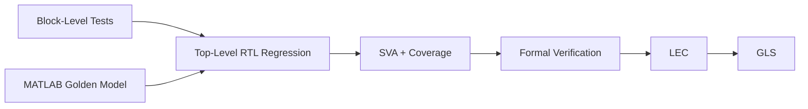

# Verification

## 1. Verification Overview

The ASIC was verified using a combination of simulation, coverage, formal verification, logic equivalence checking, and gate-level simulation.

The verification flow includes:

- block-level SystemVerilog testbenches;
- top-level RTL regression;
- MATLAB bit-accurate golden-model comparison;
- SystemVerilog Assertions and functional coverage;
- Synopsys VC Formal;
- Logic Equivalence Checking (LEC);
- Gate-Level Simulation (GLS).



---

## 2. Block-Level Verification

Self-checking SystemVerilog testbenches were developed for the main RTL blocks before top-level integration.

| Block | Main Checks |
|---|---|
| Configuration | Synchronization marker, `L` capture, reset behavior, and unsupported values |
| I Serial Master | 15/16-bit words, sign extension, word strobes, shift-strobe dividers, and forced 16-bit coefficient mode |
| Q Serial Slave | Serial reconstruction, shared word mode, sign extension, and hold/reset behavior |
| Sample History | Three-sample shift sequence, hold behavior, reset, and random input words |
| MINAJ2 | Slope update, interpolation values for `L=2..5`, fixed-point rounding, and saturation |
| Window Latch | Capture of `y0...y4` on strobe and stable hold between updates |
| Sample Shift I/Q | Phase progression, sample selection, shared I/Q phase, and simultaneous strobe handling |
| FIR | Coefficient loading, load-index progression, MAC behavior, output scaling, and saturation |

The block-level environment combines directed tests, reset and boundary cases, arithmetic corner cases, and constrained-random stimulus where appropriate. Local reference calculations are used in the arithmetic blocks to automatically check the expected results.

---

## 3. Top-Level RTL Verification

The complete design is verified using `tb_corner.sv` together with the MATLAB bit-accurate golden model.

The normal transaction contains:

```text
Synchronization + L
        ↓
10 FIR coefficients
        ↓
Serial I/Q samples
        ↓
MINAJ2 interpolation
        ↓
10-tap FIR
        ↓
DAC I/Q output
```

The MATLAB regression covers:

- all interpolation factors `L = 2, 3, 4, 5`;
- all 12 ordered transitions between different `L` values;
- long 64-QAM sequences;
- zero, DC, impulse, full-scale, and saturation cases.

Additional testbench modes check reset during coefficient loading, reset during I/Q streaming, repeated reset, and illegal configuration headers.

The RTL outputs are aligned and compared sample-by-sample with the MATLAB fixed-point golden output.

### Top-Level Golden Comparison Result

**Bit-exact RTL-to-MATLAB comparison: PASS**

A detailed regression report can be added to the repository alongside the top-level verification results.

---

## 4. Assertions and Coverage

### SystemVerilog Assertions

`spline_sva.sv` checks the main control and datapath invariants during RTL simulation.

The assertions verify, among other conditions:

- legal and stable interpolation-factor configuration;
- correct coefficient-loading progression and completion;
- no normal I/Q processing before `coeff_done`;
- correct relationship between input and output strobes;
- legal interpolation-phase range and phase progression;
- MINAJ2 slope update/hold behavior;
- positive and negative arithmetic saturation;
- FIR coefficient and output behavior.

### Functional Coverage

`spline_cov.sv` covers the major operating conditions of the design:

- all supported interpolation factors;
- all 12 ordered transitions between different `L` values;
- valid interpolation phases for each `L`;
- important control conditions;
- FIR output saturation;
- MINAJ2 slope saturation.

| Coverage | Result |
|---|---:|
| Functional coverage | **100%** |
| Assertion coverage | **100%** |

---

## 5. Formal Verification

Synopsys VC Formal was used in FPV mode to formally verify nine major RTL blocks.

The formal properties check the same key behaviors targeted by block simulation, but exhaustively over the legal state space of each block.

Examples include:

- configuration marker detection, `L` capture, and stable configuration;
- serial word counters, 15/16-bit mode, sign extension, and strobe generation;
- sample-history update and hold behavior;
- MINAJ2 slope update, interpolation-mode behavior, and saturation;
- interpolation-window capture and hold behavior;
- Sample Shift phase bounds, phase progression, and sample shifting;
- FIR coefficient loading, state update, output hold, and saturation.

Formal cover properties are also used to prove reachability of important states such as all supported interpolation modes, maximum valid phases, coefficient-loading events, and arithmetic saturation conditions.

### Formal Results

| Metric | Result |
|---|---:|
| RTL blocks verified | 9 |
| Assertions analyzed | 123 |
| Proven assertions | 118 |
| Vacuous assertions | 5 |
| Failed assertions | **0** |
| Formal cover properties | **38 / 38** |

The five vacuous properties are reset-related assertions in formal runs where reset was constrained inactive. They do not represent design failures.

---

## 6. Logic Equivalence Checking

LEC was used to verify that synthesis preserved the functionality of the RTL.

The main comparison was performed between the RTL design and the synthesized gate-level netlist.

### RTL-to-Gate Result

| Metric | Result |
|---|---:|
| LEC result | **PASS** |
| Incomplete verification | 0 |
| Design ambiguity | 0 |
| Equivalent compare points | 669 |

The repository also contains the gate-vs-gate equivalence flow used for checking the post-layout netlist against the synthesized design.

---

## 7. Gate-Level Simulation

Gate-level simulation verifies the implemented netlist using the same configuration and I/Q stimulus concept as the RTL flow.

The GLS environment:

- runs the supported interpolation modes;
- loads the ten FIR coefficients;
- streams I/Q samples through the gate-level design;
- captures the final DAC outputs;
- generates VCD activity files for power analysis.

The generated activity files are:

```text
gate_L2.vcd
gate_L3.vcd
gate_L4.vcd
gate_L5.vcd
```

Gate-level functional coverage is also collected using signals that remain observable after synthesis.

---

## 8. Verification Summary

| Verification Stage | Result |
|---|---|
| Block-level simulation | Completed |
| Top-level RTL regression | Completed |
| MATLAB golden comparison | **Bit-exact PASS** |
| Functional coverage | **100%** |
| Assertion coverage | **100%** |
| Formal verification | **0 failed assertions** |
| Formal cover properties | **38 / 38** |
| RTL-to-gate LEC | **PASS** |
| Gate-level simulation | Completed |

The combined verification flow checks the design from individual RTL blocks through the complete RTL system and synthesized gate-level implementation.
