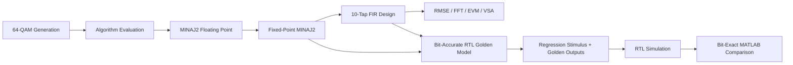

# MATLAB Modeling and RTL Golden Reference

## 1. Purpose

The MATLAB environment supports two complementary parts of the project:

1. **Algorithm development and signal-quality evaluation** — generation of the 64-QAM input signal, floating- and fixed-point MINAJ2 evaluation, 10-tap FIR design, and analysis using time-domain plots, spectra, RMSE, EVM, and VSA-compatible data.
2. **Bit-accurate RTL verification** — generation of serial regression stimulus, reproduction of the RTL integer arithmetic, and sample-by-sample comparison of the captured RTL I/Q outputs against a MATLAB golden model.



## 2. MATLAB File Map

| File | Main Role |
|---|---|
| `spline_project.m` | Main algorithm-development and signal-analysis script |
| `minAJ2_float.m` | Floating-point MINAJ2 cubic Hermite interpolation |
| `fix_firpm_coeff.m` | FIRPM coefficient generation, Q12 quantization, fixed-point FIR simulation, and VSA export |
| `spline_golden_rtl.m` | Bit-accurate integer model of the implemented MINAJ2 + FIR RTL |
| `RUN_ALL_MODES.m` | Multi-mode regression generation and post-simulation comparison flow |
| `compare_rtl_golden.m` | RTL/golden alignment search and bit-exact I/Q comparison |

Additional functions used by the flow, including `minAJ2_fixed`, `gen_tb_input`, and IQTools `iqmod`, must be available on the MATLAB path when the relevant scripts are executed.

---

# Part I — Algorithm Development

## 3. Reference 64-QAM Signal

The primary communication waveform is a complex 64-QAM baseband signal.

| Parameter | Value |
|---|---:|
| Modulation | 64-QAM |
| Input sample rate | 60 MSa/s |
| Number of symbols | 4000 |
| Samples per symbol | 3 |
| Pulse shaping | Root Raised Cosine |
| RRC roll-off | 0.15 |
| RRC span | 80 symbols |
| Supported interpolation factors | $L=2,3,4,5$ |

The signal is generated with IQTools `iqmod` and normalized before interpolation. The complex input is

$$
s[n]=I[n]+jQ[n].
$$

For interpolation factor $L$,

$$
f_{s,out}=L f_{s,in}.
$$

Therefore the supported output sample rates are 120, 180, 240, and 300 MSa/s for $L=2,3,4,5$, respectively.

## 4. `spline_project.m` — Algorithm Evaluation

`spline_project.m` is the main high-level development script. It fixes the random seed for repeatability, defines the 64-QAM/RRC parameters, generates the 60 MSa/s source waveform and a high-rate reference waveform, and compares several stages of the interpolation flow.

The script evaluates MATLAB's built-in cubic spline using `interp1(...,'spline')`, the floating-point MINAJ2 model, and the fixed-point MINAJ2 model. I and Q are processed independently and recombined into a complex waveform.

The floating-point result is aligned to the high-rate reference using cross-correlation before comparison. The script generates I/Q waveform comparisons, component-wise error plots, FFT/spectrum plots, and fixed- versus floating-point comparisons.

### RMSE

After removing the startup region used to initialize the interpolation state, the script evaluates

$$
\mathrm{RMSE}=\sqrt{\frac{1}{N}\sum_{n=0}^{N-1}|x_{ref}[n]-x_{test}[n]|^2}
$$

and

$$
\mathrm{RMSE}_{dB}=20\log_{10}(\mathrm{RMSE}).
$$

### EVM

The included EVM helper uses

$$
\mathrm{EVM}_{rms}=\sqrt{\frac{\sum |x_{test}-x_{ref}|^2}{\sum |x_{ref}|^2}}.
$$

This script is intended for algorithm and signal-quality analysis rather than exact RTL matching.

## 5. `minAJ2_float.m` — Floating-Point MINAJ2

`minAJ2_float.m` implements the floating-point cubic Hermite MINAJ2 algorithm.

For each interval, the interpolation positions are

$$
u_k=\frac{k}{L}, \qquad k=0,\ldots,L-1.
$$

The Hermite basis functions are

$$
H_{00}=2u^3-3u^2+1,
$$

$$
H_{01}=-2u^3+3u^2,
$$

$$
H_{10}=u^3-2u^2+u,
$$

$$
H_{11}=u^3-u^2.
$$

The interpolated value is

$$
y(u)=H_{00}x_0+H_{01}x_1+H_{10}m_0+H_{11}m_1.
$$

The startup slopes are initialized as

$$
s_0=x(2)-x(1)
$$

and

$$
s_1=\frac{x(3)-x(1)}{2}.
$$

In steady-state operation, the next MINAJ2 slope is

$$
s_i=\frac{-11x_{i-1}-4s_{i-1}+8x_i+3x_{i+1}}{10}.
$$

The final segment uses a terminal first-difference slope. This floating-point implementation is the algorithm-level reference; the RTL golden model described later reproduces the actual streaming startup and finite-width arithmetic.

---

# Part II — FIR Design and Fixed-Point Evaluation

## 6. `fix_firpm_coeff.m` — 10-Tap FIR Design

The FIR design script evaluates all four interpolation factors:

```matlab
Ls = 2:5;
```

For each $L$, the output rate is

$$
f_{s,out}=L\cdot60\text{ MHz}.
$$

The filter configuration is:

| Parameter | Value |
|---|---:|
| Number of taps | 10 |
| Passband edge | 14 MHz |
| Stopband edge | 44 MHz |
| Passband weight | 10000 |
| Stopband weight | 200 |
| Word length | 16 bits |
| Fraction length | 12 bits |

The floating-point coefficients are generated with `firpm`:

```matlab
firpm(NTAPS-1, Fm, [1 1 0 0], [W_PASS W_STOP])
```

where the frequency vector is normalized to the Nyquist frequency of the selected output sample rate. Consequently, each interpolation factor receives its own ten-coefficient set.

### Coefficient Quantization

The coefficients are converted to signed Q12 integers according to

$$
h_{int}=\operatorname{sat}_{16}\left(\operatorname{round}(h_{float}2^{12})\right).
$$

For each tap, the script stores:

- floating-point coefficient;
- Q12 coefficient;
- signed integer code;
- 16-bit hexadecimal representation.

The coefficient sets are collected into `firpm_coefficients_all_L.csv`.

### Fixed-Point FIR Simulation

I and Q are filtered independently using the same coefficient set. Explicit `fimath` settings define product precision, sum precision, saturation, and rounding. The script also exports pre-FIR and final signals in MAT and text formats.

## 7. VSA Export

The FIR-development flow creates:

```text
vsa_prefir_mat/
vsa_prefir_txt/
vsa_final_mat/
vsa_final_txt/
```

The MAT files contain the waveform and sample-time information required for VSA import:

```matlab
Y
XDelta
InputZoom
XStart
```

with

$$
XDelta=\frac{1}{f_s}.
$$

---

# Part III — Bit-Accurate RTL Golden Model

## 8. Why a Separate RTL Golden Model Is Used

The floating-point and high-level fixed-point models are suitable for algorithm development, but the RTL contains implementation-specific details that must be reproduced exactly during verification:

- three-sample streaming history;
- recursive slope state;
- fixed intermediate widths;
- signed wrapping;
- saturation;
- Q1.15 interpolation constants;
- explicit rounding in the MINAJ2 datapath;
- streaming FIR delay-line behavior.

`spline_golden_rtl.m` models these details directly. Its outputs are signed Q3.12 integer codes rather than normalized floating-point values.

## 9. `spline_golden_rtl.m` — MINAJ2 Golden Model

The top-level function processes I and Q independently:

```matlab
uI = minaj2_stream(I_int, L);
uQ = minaj2_stream(Q_int, L);

dacI = fir_stream(uI, coeffs_int, 12, fir_round);
dacQ = fir_stream(uQ, coeffs_int, 12, fir_round);
```

### Streaming Startup

The model starts with

```text
w0 = 0
w1 = 0
w2 = 0
m_p = 0
```

and, for every new source sample,

```text
w2 <- w1
w1 <- w0
w0 <- new sample
```

so that

```text
x_prev = w2
x_c    = w1
x_n    = w0
```

matches the RTL history registers.

### Bit-Accurate Slope Update

The integer slope numerator is

$$
Sum=8x_c+3x_n-11x_{prev}-4m_p.
$$

The RTL-compatible divide-by-ten approximation is

$$
m_{raw}=\left(Sum\cdot1638+8192\right)\gg14.
$$

The 8192 term is the half-LSB rounding bias. The result is saturated to the signed 16-bit range.

### Cubic Coefficients

The 18-bit polynomial coefficients are

$$
c_0=x_{prev},
$$

$$
c_1=m_p,
$$

$$
c_2=3(x_c-x_{prev})-2m_p-m_{new},
$$

$$
c_3=m_p+m_{new}-2(x_c-x_{prev}).
$$

Finite-width two's-complement behavior is reproduced with helper wrapping functions.

### Q1.15 Interpolation Positions

The golden model uses the same integer constants as the RTL:

| $L$ | Q1.15 Values |
|---:|---|
| 2 | 16384 |
| 3 | 10923, 21845 |
| 4 | 8192, 16384, 24576 |
| 5 | 6554, 13107, 19661, 26214 |

These correspond approximately to $1/2$, $1/3,2/3$, $1/4,1/2,3/4$, and $1/5,2/5,3/5,4/5$.

The cubic is evaluated in Horner form, with the same half-LSB addition and arithmetic right-shift behavior used in the RTL.

## 10. Bit-Accurate FIR Model

The golden FIR models a streaming delay line. For every interpolated input sample,

```text
dl <- [new_sample ; previous delay-line samples]
```

and then computes

$$
acc=\sum_{k=0}^{9}x_kh_k.
$$

The output is

$$
y=\operatorname{sat}_{16}\left((acc+RND)\gg12\right).
$$

The regression currently uses

```matlab
FIR_ROUND = 0;
```

so no additional FIR rounding bias is included in the RTL golden result.

---

# Part IV — Full RTL Regression

## 11. `RUN_ALL_MODES.m` — Regression Controller

`RUN_ALL_MODES.m` is the main MATLAB entry point for top-level RTL regression. The principal settings are:

```text
WL         = 16
FL         = 12
fs_in      = 60 MHz
FIR_ROUND  = 0
Ls         = [2 3 4 5]
QAM        = 4000 symbols, 3 samples/symbol, alpha = 0.15
```

The script performs two roles:

1. generate stimulus and golden data before RTL simulation;
2. compare RTL output files when they become available.

## 12. Transition Regression

All ordered transitions between different legal interpolation factors are generated. For four legal values, this produces 12 transitions:

```text
2 -> 3    2 -> 4    2 -> 5
3 -> 2    3 -> 4    3 -> 5
4 -> 2    4 -> 3    4 -> 5
5 -> 2    5 -> 3    5 -> 4
```

The normal segments use long seeded 64-QAM sequences so they are also suitable for VSA/EVM analysis.

## 13. Corner Cases

The regression additionally creates:

| Test | $L$ | Purpose |
|---|---:|---|
| Zero | 2 | All-zero datapath behavior |
| DC | 4 | Constant input behavior |
| Impulse | 5 | Transient response |
| Full-scale | 3 | Large signed values |
| Full-scale | 2 | Large signed values |
| Maximum saturation | 4 | FIR/arithmetic saturation stress |

Each corner segment contains 1024 source samples. For $L=3$ and $L=5$, the generated samples are converted through the same signed 15-bit representation expected by the serial interface.

## 14. Regression FIR Coefficients

For each normal segment, `RUN_ALL_MODES.m` generates ten FIR coefficients with

```matlab
firpm(10-1, Fm, [1 1 0 0], [10000 200])
```

using the same 14 MHz passband edge, 44 MHz stopband edge, Q12 scaling, and 16-bit saturation used by the development flow.

The `maxsat` corner is intentionally different: all ten coefficients are set to maximum positive 16-bit values to stress saturation behavior.

## 15. Generated Regression Files

The first MATLAB run creates:

```text
seg*.txt
manifest.txt
regression_golden.mat
```

and saves VSA-compatible input and golden waveforms.

`manifest.txt` defines the segment sequence used by the SystemVerilog testbench. `regression_golden.mat` stores the expected I/Q vectors and metadata for each segment.

The VSA regression folders are:

```text
vsa/input/
vsa/golden_prefir/
vsa/golden_dac/
vsa/rtl_raw/
vsa/rtl_dac_aligned/
```

The final two directories are populated after RTL output files exist.

## 16. Two-Pass Regression Flow

```text
First MATLAB run
      │
      ├── generate serial stimulus
      ├── generate FIR coefficients
      ├── calculate golden outputs
      ├── write manifest.txt
      └── save input/golden VSA data
      │
      ▼
Run RTL simulation
      │
      └── testbench creates seg*.txt.out
      │
      ▼
Second MATLAB run
      │
      ├── detect RTL/golden alignment
      ├── perform bit-exact comparison
      ├── report pass/fail
      └── save aligned RTL VSA data
```

---

## 17. `compare_rtl_golden.m` — Bit-Exact Comparison

`compare_rtl_golden.m` reads RTL output files containing hexadecimal I/Q pairs and converts the values to signed 16-bit integers.

Because the captured RTL stream may contain a deterministic startup offset, the function tests all legal offsets between the RTL vector and the golden vector. For every candidate offset it counts

```text
I mismatches + Q mismatches
```

and keeps the alignment with the minimum mismatch count. The search stops immediately if a zero-mismatch alignment is found.

The function returns:

```matlab
ok
offset
nbad
```

where:

- `ok = true` indicates a bit-exact match;
- `offset` is the detected RTL-to-golden sample offset;
- `nbad` is the total number of mismatched I and Q samples.

For failures, the checker reports the first mismatch and the maximum absolute I/Q error.

---

## 18. Relationship Between the MATLAB Models

The MATLAB files intentionally represent different verification levels.

| Model | Purpose | Relationship to RTL |
|---|---|---|
| MATLAB cubic spline | General interpolation reference | Algorithm comparison only |
| `minAJ2_float.m` | Floating-point MINAJ2 | Algorithm-level reference |
| `minAJ2_fixed` | Hardware-oriented fixed-point model | Fixed-point quality analysis |
| `fix_firpm_coeff.m` | FIR design and coefficient quantization | Filter-development reference |
| `spline_golden_rtl.m` | Integer streaming model | **Bit-accurate RTL reference** |
| `compare_rtl_golden.m` | Output checker | Requires exact signed-integer match |

The floating-point MINAJ2 output is therefore not used directly as the expected RTL output. The direct RTL reference is `spline_golden_rtl.m`.

## 19. Recommended Usage

For algorithm and signal-quality evaluation, use:

```text
spline_project.m
minAJ2_float.m
minAJ2_fixed
fix_firpm_coeff.m
```

For RTL regression, use:

```text
RUN_ALL_MODES.m
spline_golden_rtl.m
compare_rtl_golden.m
```

Typical RTL-regression sequence:

```matlab
% 1. Generate stimulus and golden data
RUN_ALL_MODES

% 2. Run RTL simulation externally

% 3. Run MATLAB again after *.out files exist
RUN_ALL_MODES
```

## 20. Summary

The MATLAB environment spans the complete path from communication-signal generation to bit-accurate RTL verification. The high-level models are used to evaluate interpolation quality and fixed-point effects, the FIRPM flow generates the programmable ten-tap coefficient sets, and the integer golden model reproduces the implemented streaming arithmetic so that every captured I/Q RTL sample can be checked exactly.

Keeping the **algorithm model**, **fixed-point design model**, and **RTL golden model** separate makes the MATLAB environment useful both for DSP development and for ASIC verification.
